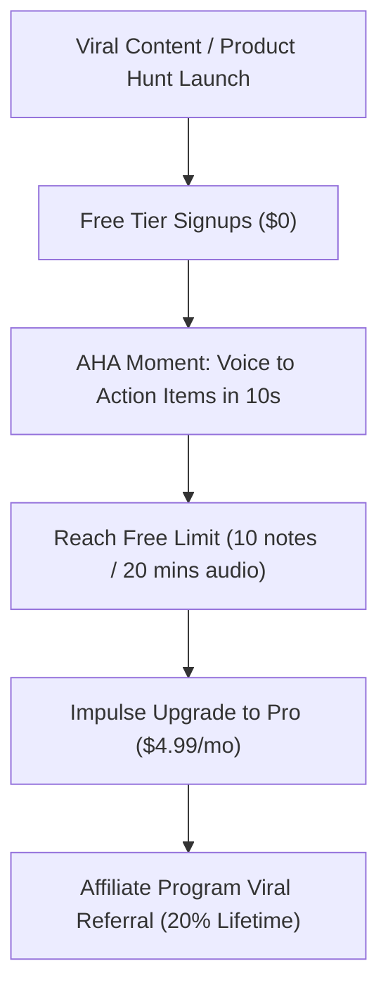

# 🪶 SwiftyQuill: Product Blueprint, Growth & Monetization Strategy

---

## 📌 Executive Summary

**SwiftyQuill** is an AI-powered, voice-first note-taking and knowledge workspace. It bridges the gap between raw thought capture and actionable intelligence. By converting voice memos and rich notes into structured transcriptions, automatic summaries, action item lists, and key insights, SwiftyQuill enables users to capture ideas seamlessly without breaking their creative flow.

---

## 🚀 1. What the Product Does

SwiftyQuill combines high-performance web architecture (Next.js 14, Tailwind CSS, Prisma, Cloudflare R2, PostgreSQL) with cutting-edge AI capabilities:

### Core Features:
- 🎙️ **AI Voice Memos & Instant Transcription**: Speak thoughts freely; SwiftyQuill asynchronously transcribes audio using AI workers (`AIJob` background queue).
- 🧠 **Automated AI Intelligence**: Generates concise summaries, extracts actionable tasks (`actionItems`), and surfaces critical highlights (`keyInsights`) from raw notes and audio recordings.
- 📁 **Cloud Storage Integration**: Built-in audio and image uploads powered by Cloudflare R2 object storage with granular user storage tracking (`storageUsed`).
- 🏷️ **Dynamic Tagging & Organization**: Custom tags, pin/star shortcuts, custom note colors, and multi-filter navigation.
- 👥 **Collaborative Note Sharing**: Secure sharing mechanism (`SharedNote`) for team and peer distribution.
- 🛡️ **Enterprise-Grade Admin & Analytics Engine**: 
  - Real-time API logging & Audit trails (`ApiLog`, `AuditLog`).
  - Storage quota tracking & user growth analytics.
  - Built-in Content Moderation & User Management (`Report`, `UserStatus`).
  - System Broadcasts & Notifications (`Notification`).
- 💸 **Built-in Affiliate System**: Programmatic referral code generator (`Affiliate`) for organic affiliate tracking and payout management.

---

## 🌟 2. Product Potential & Market Opportunity

The global digital note-taking and AI transcription market is experiencing explosive growth, driven by:
- **Remote Work & Meeting Fatigue**: Professionals need rapid summary generation without sitting through 60-minute recordings.
- **Voice-First Productivity Boom**: Apps like AudioPen, Notion AI, Granola, and Otter.ai have validated massive consumer willingness to pay for voice-to-structured text transformation.
- **Low Barrier Impulse Pricing**: At **$4.99/mo**, SwiftyQuill sits in the "no-brainer impulse purchase" zone, driving higher signup-to-paid conversion rates compared to $15–$30 enterprise tools.

---

## 💳 3. Streamlined Revenue Model (2 Tiers)

SwiftyQuill operates on a ultra-simple 2-tier pricing structure designed for maximum conversion:

| Tier | Price | Target Audience | Features |
| :--- | :--- | :--- | :--- |
| **Free Plan** | **$0** / month | Casual Users & Try-Outs | Up to 10 notes, 20 mins AI audio transcription/month, standard search, 500MB R2 storage. |
| **Pro Unlimited** | **$4.99** / month   *(or $49 / year)* | Professionals, Creators, Founders, Students | **Unlimited notes**, 10+ hours AI voice transcription/month, AI Summaries & Action Item extraction, 15GB R2 storage, priority AI job processing, and note sharing. |

---

## 🎯 4. Roadmap to $3,500 – $5,000 MRR at $4.99/mo

Because **$4.99/mo** is a high-converting "impulse price", reaching your revenue target relies on volume driven by viral acquisition loops:

### Target Subscriber Volume:
- 🎯 **$3,500 MRR Goal**: Requires **702 active Pro subscribers** ($4.99 × 702 = **$3,502.98 / mo**).
- 🚀 **$5,000 MRR Goal**: Requires **1,002 active Pro subscribers** ($4.99 × 1,002 = **$4,999.98 / mo**).

---

### Step-by-Step Growth Strategy:

1. **Leverage Impulse Pricing Positioning**:
   - Market SwiftyQuill as *"Unlimited AI Note & Voice Intelligence for less than a cup of coffee ($4.99/mo)"*.
   - Impulse pricing ($4.99/mo) typically yields a **5% to 8% free-to-paid conversion rate** (vs 1-2% for $15+ apps).

2. **Viral Launch & Product Hunt Blitz**:
   - Launch on Product Hunt, Reddit (r/productivity, r/apps), Twitter/X, and Hacker News.
   - Targeting 10,000 free signups from launch events at a 7% conversion rate yields **700 Pro users** ($3,500 MRR) almost immediately.

3. **Activate the Built-in Affiliate Network**:
   - Utilize SwiftyQuill's native `Affiliate` engine to offer creators 20% recurring commission (~$1.00/mo per user referred).
   - Micro-influencers love promoting $4.99 tools because their audience converts at high rates.

4. **SEO & Free Audio Converter Lead Magnets**:
   - Create free landing pages like *"Free Voice Memo to Action Items Converter"*.
   - Collect email signups and convert them into $4.99/mo Pro subscribers via onboarding drip emails.

---

## 🔥 5. What Makes SwiftyQuill Stand Out (Differentiators)

1. **Unbeatable Value ($4.99/mo)**:
   - Competitors charge $10–$20/mo for voice transcription. Offering full AI action item extraction for $4.99 makes SwiftyQuill the most accessible AI note-taking app on the market.

2. **Instant Thought-to-Action Pipeline**:
   - Most note apps just transcribe. SwiftyQuill extracts structured **Action Items** and **Key Insights** in one click, turning spoken thoughts directly into a to-do list.

3. **Built-in Affiliate & Viral Growth Engine**:
   - Includes a full referral framework natively built into its database and admin system to power organic user growth.

4. **Cost-Efficient R2 Architecture**:
   - Powered by Cloudflare R2 object storage, maintaining near-zero storage costs for audio & image media while providing ultra-fast delivery.
